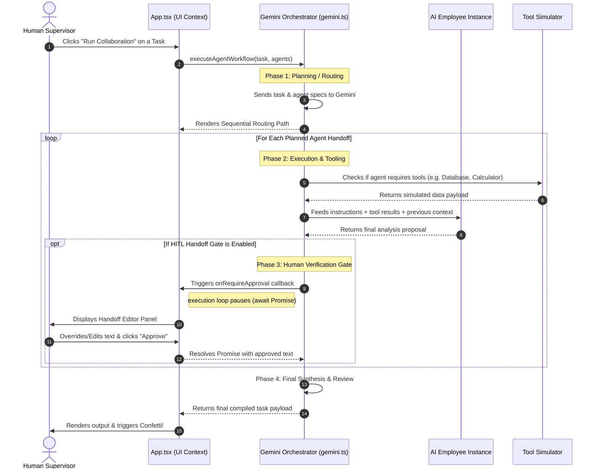

# AgentHub AI — The Operating System for AI Employees 🚀

[](https://vitejs.dev/)
[](https://react.dev/)
[](https://fastapi.tiangolo.com/)
[](https://tailwindcss.com/)
[](https://deepmind.google/technologies/gemini/)


> **AgentHub AI** is an advanced Multi-Agent Collaboration Hub and Operational Dashboard designed as an "Operating System" for AI Employees. Instead of simple chatbot prompts, AgentHub compiles complex business objectives into sequential multi-department workflows where specialized agents execute tools, calculate metrics, and debate approvals—gated by Human-in-the-Loop review.

---

## ⚡ Game-Changing Advanced Features

### 1. 🛑 Human-in-the-Loop (HITL) Handoff Gates
Never let AI execute critical business decisions unsupervised.
* **Pause-and-Verify:** The execution pipeline pauses at each departmental handoff (e.g., Sales proposing a discount to Finance).
* **Supervisor Override:** A glassmorphic gate panel displays the payload context. Supervisors can read, completely rewrite/override the text, and click `Approve & Continue` or `Reject Handoff` to terminate.

### 2. 💬 Slack-style Agent Debate Chat
Watch agents argue, calculate, and cooperate in real time.
* **Threaded Channels:** Restyled messaging pane featuring dedicated channels (e.g., `#verify-commercial-discount`, `#review-q2-budget-margins`).
* **Automated Reactions:** Agents react to each other's outputs (e.g., Finance reacting 👎 to low margin thresholds; Legal reacting 🧠 to audit compliance).
* **Interactive Emojis:** Supervisors can hover over any bubble to toggle reactions (👍, 🧠, 💡, 🔥) and increment/decrement counts dynamically.

### 3. 🎨 Animated SVG Pipeline Canvas
* **DOM-Measured Bezier Paths:** Uses React Refs and bounding box calculations to compute coordinates in real-time, drawing precise paths connecting cooperating agents.
* **Animated Dash Streams:** The paths animate with a flowing dash stream to visualize live data routing during runs.

### 4. 📈 High-Fidelity Workspace Dashboard
* **Count-up Animations:** Key performance indicators (KPIs) count up from `0` to their target values on mount using custom `requestAnimationFrame` cubic ease-out transitions.
* **Recent Activity Feed:** An audited trail showing recently completed tasks, agent execution runtimes, and SLA satisfaction indexes.
* **Workload Charting:** Beautiful proportional bar charts showing task distribution per agent with interactive hover metrics.

---

## 🛠️ Tech Stack & Architecture

### Frontend (Console)
* **Framework:** React + Vite + TypeScript (configured with strict compilation targets)
* **Styling:** Tailwind CSS + Glassmorphic elements + Custom `@keyframes` CSS animations
* **Animations:** Framer Motion (for modal springs and slide-ins) + Canvas Confetti (on compilation completion)
* **Icons:** Lucide React

### Backend (Orchestrator Proxy)
* **Framework:** FastAPI + Python 3.9+
* **Dependencies:** Google Generative AI Python SDK (`google-generativeai`), Uvicorn, Pydantic
* **LLM Engine:** Gemini 1.5 Flash (for lightning-fast token processing and cost-effective workflows)

---

## 🚀 Getting Started (Quick Launch)

The project includes an automatic, single-click Windows launcher that handles virtual environments, installs requirements, installs frontend node modules, and spins up both servers.

### Prerequisites
* **Node.js** (v18+)
* **Python** (v3.9+)

### Installation & Run

1. Clone this repository:
   ```bash
   git clone https://github.com/Madhav2246/AgentAI-Hub.git
   cd AgentAI-Hub
   ```

2. Configure your API Keys:
   Create a `.env` file in the `backend/` directory:
   ```env
   GEMINI_API_KEY=your_gemini_api_key_here
   ```
   *(Alternatively, you can configure your API keys live in the **Settings** tab of the running web application).*

3. Run the launcher script:
   Double-click the **`start_app.bat`** file in the root folder, or run it via terminal:
   ```cmd
   .\start_app.bat
   ```

4. Open your browser:
   * **Console Webapp:** [http://localhost:5173](http://localhost:5173)
   * **FastAPI Backend Swagger:** [http://localhost:8000/docs](http://localhost:8000/docs)

---

## 📁 Repository Structure
```
AgentAI-Hub/
├── backend/                  # FastAPI python server
│   ├── main.py               # REST API server & proxy routes
│   ├── orchestrator.py       # Sequential planning logic
│   └── requirements.txt      # Python dependencies
├── frontend/                 # Vite + React app
│   ├── src/
│   │   ├── components/       # Layout parts (Sidebar)
│   │   ├── pages/            # View Pages (Dashboard, Tasks, Workflows, Slack Chat...)
│   │   ├── services/         # API Service (Gemini RAG orchestration loops)
│   │   └── types/            # TypeScript type declarations
│   ├── tailwind.config.js    # Styling boundaries
│   └── tsconfig.json         # Strict compiler targets
└── start_app.bat             # Concurrent launcher batch file
```

---

## 💎 Show-stopping Details for Presentation
* **Aurora Pulsing Nodes:** Check out the glowing node pulses and matching department avatars in the Workflows page.
* **Typewriter Simulation:** The Landing Page features a live typing mockup executing steps automatically on a loop.
* **Instant RAG Search:** Filter documents inside the **Knowledge Base** instantly by typing in the search bar.

---

## 🔍 How It Works: Technical Deep Dive

Here is the exact lifecycle of how a task is planned, verified, and executed across multiple AI agents:



### Detailed Execution Phases

#### Phase 1: Heuristic & Generative Planning
1. When you trigger a task, the **Orchestrator** compiling logic reads the available agent profiles (names, roles, tools, instructions) and the user's task prompt.
2. It sends this to the Gemini LLM with a structural request: *"Build a sequential step-by-step execution graph selecting the correct agents and tools in JSON format."*
3. The orchestrator logs this planning step, updating the Sidebar and Workflow canvases in real-time.

#### Phase 2: Contextual Handoff Loop (Chaining)
1. The orchestrator loops through the plan sequence. For each agent:
   * **Tool Execution:** If the plan chose a tool (e.g., Sales using `Database Search`), a simulation query is run to generate a context block (like mock CRM contracts or margin figures).
   * **Prompt Synthesis:** A comprehensive prompt is built dynamically combining the agent's backstory, their instructions, the tool's results, and the **entire accumulated text output of all previous steps**.
   * **In-Character Execution:** Gemini runs the prompt with a system instruction to speak strictly as that agent's persona.

#### Phase 3: The Human-in-the-Loop Promise Pause (The Gate)
1. When transitioning from Agent A to Agent B:
   * If **HITL Gates** are enabled, `gemini.ts` invokes `onRequireApproval()` and `await`s the Promise.
   * In React, this state activates `approvalData` which blocks page updates and renders a modal card. The Promise's `resolve` function pointer is saved inside a React Ref (`approvalResolverRef.current = resolve`).
   * When the user reviews the text, edits any errors, and clicks **Approve**, the click handler triggers `approvalResolverRef.current(editedText)`.
   * This immediately resolves the awaited Promise, and the loop moves on to Agent B with the newly corrected inputs!

#### Phase 4: Slack-style Conversations Feed Sync
1. Every action (thoughts, tool runs, messages) is logged as a `StepLog` entity.
2. The **Conversations** panel renders these logs inside a styled Slack channel.
3. Other agents run standard heuristics to react to the messages (e.g., if Sales proposes a discount, the Finance agent's icon automatically triggers a `👎` reaction; once Legal resolves it, other agents react with `👍` or `🔥`).
4. Users can interactively click these reactions to toggle counts, storing clicks inside `userReactions` states.
